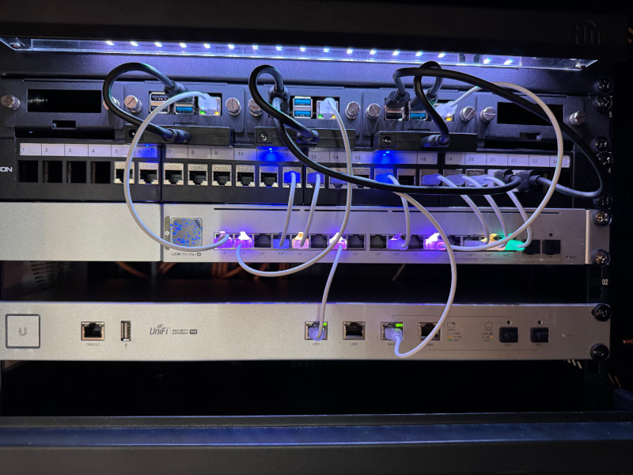

# Homelab Ansible Repository

This repository contains the Ansible configuration used to deploy and manage services in my homelab and on a  VPS. 



---

## High-Level Layout

```text
.
├── ansible.cfg                # Ansible configuration
├── playbooks/                 # Entry-point playbooks
├── inventory/                 # Inventory and host/group variables
│   ├── inventory.yml
│   ├── group_vars/
│   │   ├── all/
│   │   │   ├── all.yml        # Global non-secret variables
│   │   │   └── secrets.yml    # Encrypted with ansible-vault
│   │   └── homelab/           # Service-level configuration
│   └── host_vars/
│       └── strato_vps/        # VPS-specific configuration
├── roles/                     # Reusable Ansible roles
├── .pre-commit-config.yaml    # Local safety checks (vault enforcement)
└── .gitignore
```

---

## Inventory & Variables

### Inventory

* `inventory/inventory.yml` defines the managed hosts and groups
* Hosts are grouped by function (homelab, VPS)

### Variables

* `group_vars/all/all.yml`

  * Global, **non-secret** configuration

* `group_vars/all/secrets.yml`

  * **Encrypted with ansible-vault**
  * Contains all sensitive data (tokens, passwords, keys)
  * Protected by a local pre-commit hook to prevent plaintext commits

* `group_vars/homelab/*.yml`

  * Service-level configuration

* `host_vars/strato_vps/`

  * VPS-specific overrides and settings

---

## Secrets Handling (Important)

This repository follows a strict secrets policy:

* **All secrets live in ****`group_vars/all/secrets.yml`**
* That file **must always be encrypted** using `ansible-vault`
* No secrets are stored in plaintext anywhere in the repository

### Runtime Files

Files such as `.env` are:

* Generated from Jinja2 templates (`*.j2`)
* Filled with values from Vault at deploy time
* Considered **runtime artifacts**
* Explicitly ignored via `.gitignore`

### Safety Net

A local `pre-commit` hook checks that `secrets.yml` is encrypted before allowing a commit.

---

## Roles

Each role is self-contained and follows the standard Ansible layout:

```text
roles/<role>/
├── tasks/
├── defaults/
├── handlers/
└── templates/   # docker-compose.yml.j2, env.j2, configs
```

Notable roles include:

* `traefik_vps` – reverse proxy 
* `wireguard` – VPN connectivity
* `nftables` – firewall / masquerading
* `paperless`, `wikijs`, `grafana`, `authelia`, `nut`, `gitea`
* `ca_internal` – internal CA and certificate management

---

## Typical Usage

This repo currently uses **split playbooks** so individual aspects can be tested independently.

Typical entry playbooks

```bash
ansible-playbook playbooks/homelab.yml --check --diff
ansible-playbook playbooks/traefik_internal.yml --check --diff
ansible-playbook playbooks/vps_base.yml --check --diff
ansible-playbook playbooks/traefik_vps.yml --check --diff
ansible-playbook playbooks/wireguard.yml --check --diff
```

---

## Git Hygiene & Safety

* `.env` and other generated files are ignored

* Vault files are **not ignored**, but actively checked

## Status

This is an actively used personal homelab repository. Structure and roles evolve over time.